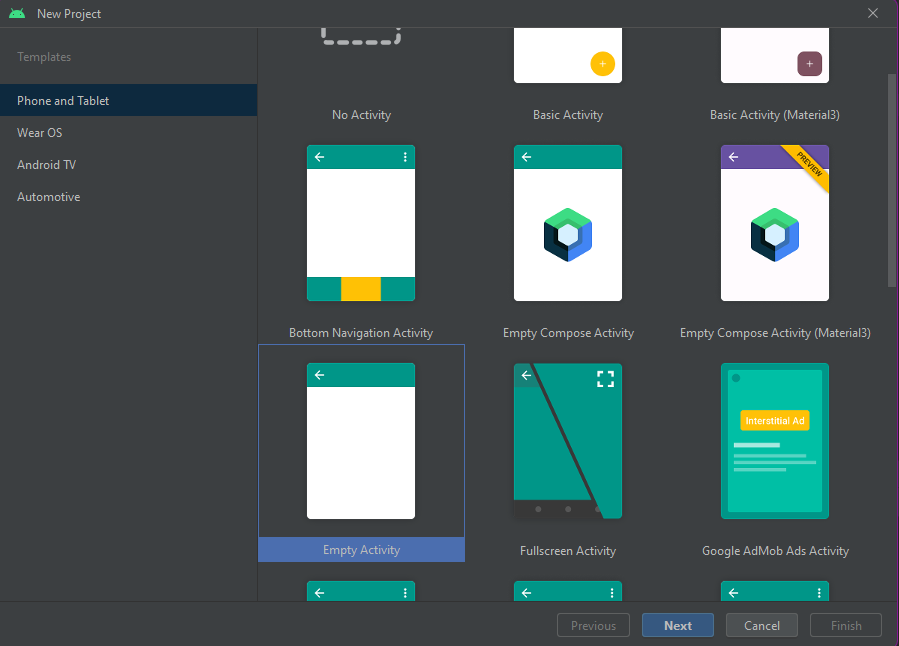
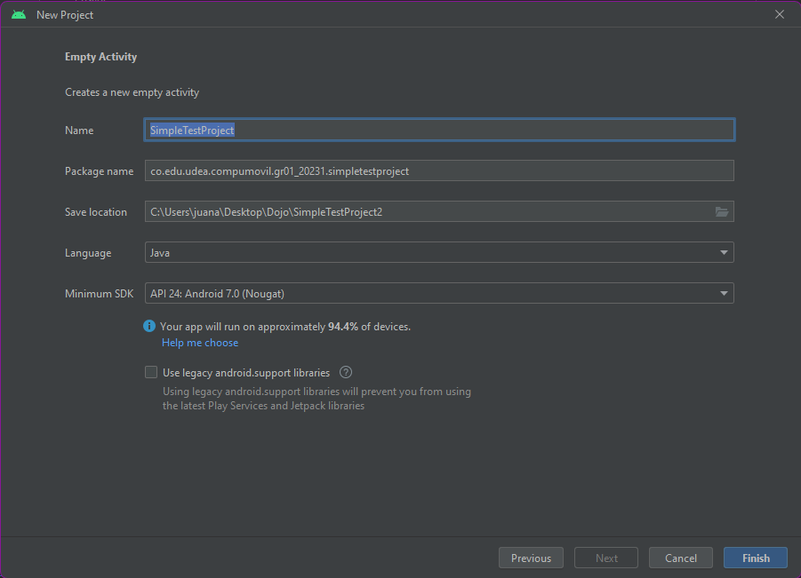
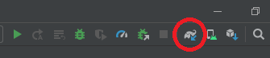
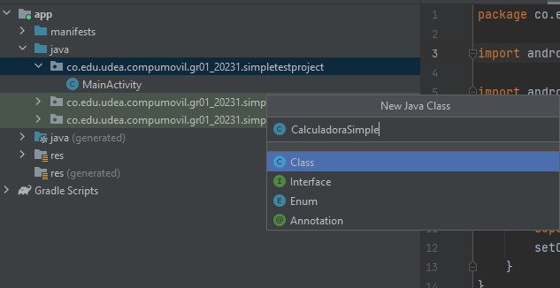
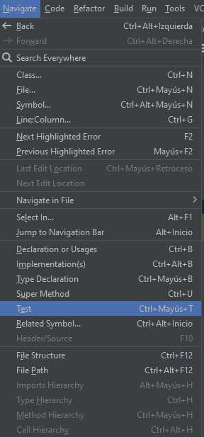
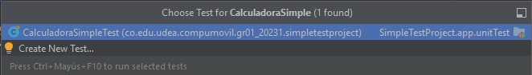
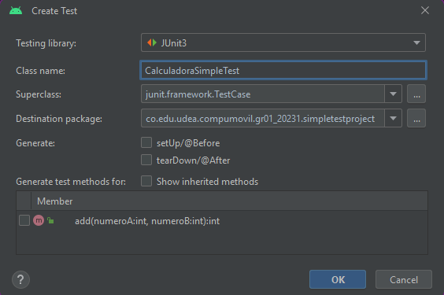
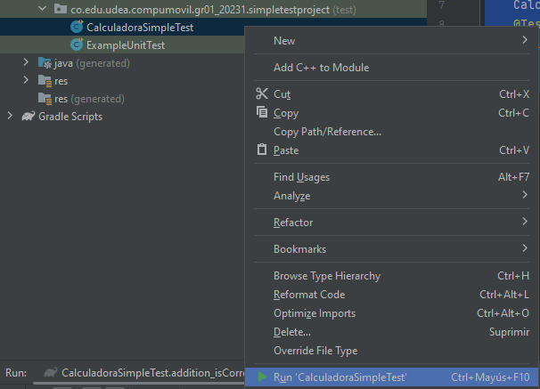
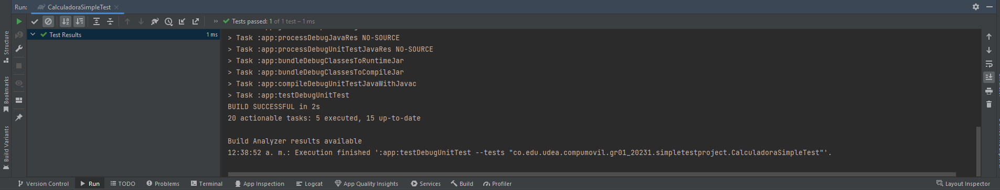
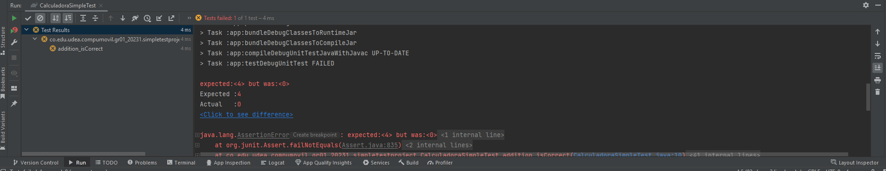

author: Trinta team
summary: Dojo codelab para testing
id: testing-dojo-codelab
tags:
categories:
environments: Web
status: Published
feedback link: https://github.com/SolaceDev/solace-dev-codelabs/blob/master/markdown/testing-dojo-codelab

# Testing codelab
Testing codelab

## Primeros pasos
Duration: 0:02:00

Para empezar a hacer los diferentes tipos de pruebas/test, vamos a crear un nuevo proyecto en Android Studio

seleccionaremos una nueva aplicacion vacia, para luego crear nuestro proyecto con el nombre "SimpleTestProject",
seleccionaremos como lenguaje Java y crearemos nuestro proyecto en el directorio especifico:

## Dependencias
Duration: 0:03:00

Para este proyecto, inicialmente instalaremos algunas dependencias (estas pueden venir por defecto al crear el proyecto)
(ingrese al archivo llamado: "build.gradle" para este paso)

    dependencies {
        // Otras dependencias
        // Dependencias para el testing
        testImplementation 'junit:junit:4.13.2'
    }

Para que las dependencias queden correctamente instaladas recuerde hacer click en el boton:

## Creacion de test unitario
Duration: 0:03:00

Para hacer nuestro primer test, haremos uso de una funcion simple donde sumaremos 2 números cualquiera y esperaremos que este nos devuelva el resultado total de la suma (cree una clase llamada CalculadoraSimple para este paso):

y agrege en esta la funcion:

    public int add (int numeroA, int numeroB) {
        return numeroA + numeroB;
    }

## Creacion de la clase Test

1. Abrir ayudas para generar test en la parte superior del menu:

entre a la clase que va a testear ("CalculadoraSimple") y de click en el nombre de la clase
luego dirijase al menu superior y vayase a:

Navigate>Test

2. Crear clase test:

Al dar click en test se mostrara una ventan como esta:

de click en create new test:

En esta ventana, cree el test con la misma nomenclatura-nombre que su clase pero con la palanra "Test" al final

3. Creacion finalizada: 

Al crear la clase nos podemos dar cuenta que el nombre que necesitamos estara creado por defecto, pulsaremos ok.

4. al momento de crear el test, notara que este se creara en una nueva carpeta con el mismo orden de carpetas que su clase (CalculadoraSimple)

## Crear test

Ahora haremos un test simple en el que verificaremos que nuestra funcion calculadora, nos generara el resultado esperado segun los parametros que ingresemos, para esto comenzaremos por crear un objeto de nuestra clase CalculadoraSimple para hacer uso de la funcion que creamos anteriormente:

    CalculadoraSimple calulador = new CalculadoraSimple();

luego usaremo la etiqueta:

    @test

para crear el test que deseamos, en este caso nuestro test seria algo como esto:

    public void addition_isCorrect() {
        assertEquals(4, calulador.add(2,2));
    }

hacemos uso de assertEquals para comparar el resultado de nuestra funcion con lo que sabemos que debe resultar:

## Nota

Notara que encuentra algunos errores en su clase, solo consta de agregar estos imports en la clase:

    import static org.junit.Assert.assertEquals;
    import org.junit.Test;

y listo! su clase se debe ver de la siguiente manera:

    import static org.junit.Assert.assertEquals;
    import org.junit.Test;

    public class CalculadoraSimpleTest {
        CalculadoraSimple calulador = new CalculadoraSimple();
        @Test
        public void addition_isCorrect() {
            assertEquals(4, calulador.add(2,2));
        }
    }

## A testrear!
Duration: 0:03:00

Con todo preparado, ya podremos testear para ejecutar el test solo debemos dar click derecho en el nobre de nuestro test

si todo ha salido bien, se abrirá la terminal y nos enseñara el resultado del test.

para saber que nuestro test esta funcionando de manera correcto, solo debemos hacer que nuestra logica falle!
para esto volveremos a nuestra clase CalculadoraSimple y cambiaremos el simbolo de suma por un simbolo de resta de esta manera:

    public int add (int numeroA, int numeroB) {
        return numeroA - numeroB;
    }

volveremos a ejecutar nuestro test:

y veremos que el test nos devuelve una respuesta de error: 

